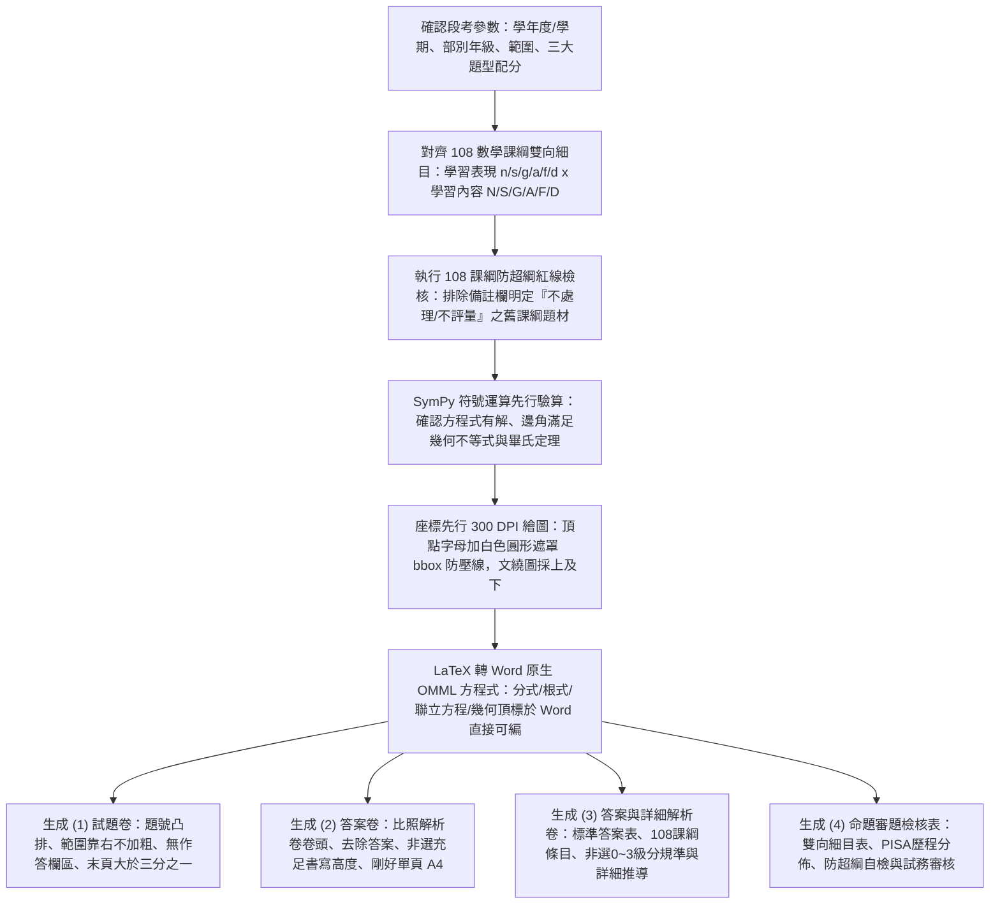

# 國高中數學科 108 課綱素養命題規範與自動化產卷技能 (jhsh-math-exam-generator)

本 Skill 專門用於指導 Antigravity 代理人自動化命題，生成完全符應「新北市立錦和高級中學」教務處/試務組規範，且深度結合**教育部《十二年國民基本教育課程綱要—數學領域（108 課綱）》**（核心素養、學習表現、學習內容、備註欄防超綱界線、學習評量實施要點）、國教院素養導向紙筆測驗要素與國際 PISA 數學評量架構之正式數學段考**四大獨立檔案**：試題卷、答案卷、答案與詳細解析卷，以及命題審題雙向細目檢核表。

---

## 快速開始：使用者提詞標準模板 (User Prompt Template)

> [!TIP]
> **若使用者不知道如何下指令或初次使用本技能，請主動告知並引導使用者複製以下虛擬範例模板並依當次範圍修改：**

```text
請使用 jhsh-math-exam-generator 技能為我生成一份數學科段考試卷，規格參數如下：
1、年級與範圍：【請填寫學年度、年級與章節，例如：115學年度第一學期 國中部九年級 第3章 幾何與證明（3-1證明與推理、3-2三角形的外心、內心與重心）】。
2、題型與配分：總分 100 分
   - 第一部分：單一選擇題【例如：10 題，每題 4 分，共 40 分】
   - 第二部分：填充題【例如：10 格，每格 4 分，共 40 分】
   - 第三部分：非選擇題（計算證明題）【例如：2 題，每題 10 分，共 20 分】
3、難易程度：【例如：難易適中（預估平均通過率約 65%，兼顧基本觀念熟練與素養幾何推論）】。
4、格式要求：
   - 遵循錦和高中試務組最新標準規範，輸出成 4 份獨立 Word (.docx) 檔（試題卷、答案卷、答案與詳細解析卷、命題審題檢核表）。
   - 試題電子檔檔名請按校方統一格式命名（如：115上國九數學段三試題.docx、115上國九數學段三答案卷.docx）。
   - 試題卷純粹化：取消填充作答欄與非選作答區（學生一律於獨立答案卷作答），題號靠左凸排，每題出題範圍小括號靠右且不加粗體，填充題題號不使用小括號。
   - 圖形文繞圖採「上及下」，圖形與圖名保持適當垂直距離，幾何英文字母加白色圓形遮罩防止與線段重疊。
   - 答案卷格式比照解析卷（去除答案與詳解，保留大題作答表格與非選作答空間，剛好單頁 A4 不跨頁）。
   - 所有代數公式使用 Word 原生可編輯 OMML 方程式，以 SymPy 100% 自動驗算無矛盾。
```

---

## 核心工作流程 (Workflow)



---

## 一、 錦和高中數學科試務組排版與題型標準規範

生成 Word (`.docx`) 檔案時，**必須嚴格遵循以下校方與試務組排版規則**：

### 1. 試題電子檔名稱統一格式（校方規範 2）
- 命名公式：`[學年度][上/下][國/高][年級][科目]段[次][試題/答案卷/答案與詳細解析/命題審題檢核表].docx`
- 正式範例（以 115 學年度第一學期國中部九年級第三次段考為例）：
  1. 試題卷：`115上國九數學段三試題.docx`
  2. 答案卷：`115上國九數學段三答案卷.docx`
  3. 答案與詳細解析卷：`115上國九數學段三答案與詳細解析.docx`
  4. 命題審題檢核表：`115上國九數學段三命題審題檢核表.docx`

### 2. 試題抬頭、命題範圍與頁尾格式（校方規範 1）
- **試題卷抬頭**：以粗體加底線打上〔新北市立錦和高級中學115學年度第一學期國中部○年級○○科第三次段考試題〕（若為高中部則為高中部）。
- **命題範圍**：加上﹝命題範圍：...﹞，並於右側標註「班級：____ 座號：__ 姓名：________」。
- **頁尾**：試卷頁尾加上〔第X頁,共X頁〕（中式括號或六角括號），透過 Word 動態欄位（`PAGE` 與 `NUMPAGES`）自動計算。

### 3. 版面設定與字體（校方規範 3）
- **邊界**：上下各 1.0 cm，左右各 1.0 cm（`top=0.3937 in, bottom=0.3937 in, left=0.3937 in, right=0.3937 in`）。
- **字體**：中文一律使用 **標楷體**，英數字使用 **Times New Roman**，原生數學方程式使用 **Cambria Math**。
- **字體大小**：主標題 13.5～14 Pt 粗體底線；大題標題 11.5 Pt 粗體；**全卷正文、題幹、選項、方程式、解析一律嚴格維持 11 點字 (11 Pt)**；圖名與圖說 9.5 Pt；頁尾動態頁碼 10 Pt。
- **行距與防裁切**：正文段落行距設為 `1.15` 倍（含多重分式或根號之段落不鎖死固定行高，確保分子分母不被裁切）。

### 4. 必放注意事項（扣分警語，校方規範 5、6、7）
為減少同學因忘記填寫姓名而扣分的情形，請在試題與答案卷上註明以下警語：
1. **考生身份判讀警語（紅字粗體）**：
   - 「**答案卷(卡)未寫班級、姓名、座號，或畫卡錯誤致電腦無法判讀考生身份者，一律扣5分**」。
2. **非選擇題黑色墨水筆作答警語**：
   - 「**非選擇題請用黑色墨水筆作答，違者扣非選擇題總分5分**」。
3. **選擇題與非選擇題於同一張答案卷時之通則警語**：
   - 「**請一律用黑色墨水筆作答，違者扣總分5分**」。

### 5. 試題卷純粹化排版標準（使用者修訂指示）
- **試題卷上完全取消填充題作答欄、完全取消非選擇題作答方框**：
  - 試題卷僅供閱讀題目，學生一律在獨立的「答案卷」上作答。
  - **試題卷與答案卷上徹底刪除「作答欄」、「作答區」等贅字**。
- **題號靠左凸排 (Hanging Indent)**：
  - 每題題號一律靠左凸出，凸排參數：`left_indent = Inches(0.28)`, `first_line_indent = -Inches(0.28)`。
- **出題範圍標籤靠右對齊且不加粗體**：
  - 每題題幹末尾以小括號標記出題範圍，如 `(3-1)` 或 `(3-2)`。
  - **字型嚴格取消加粗體 (`bold=False`)**。
  - 於題幹尾端加入製表符 `\t`，並設定段落右對齊定位點（Right Tab Stop at 7.48 英吋），使範圍標籤整齊貼合右邊界。
- **填充題題號規範**：
  - **題號請和選擇題一樣，使用 `1.`～`10.`，嚴禁使用小括號 `(1)` 做題號**。
  - 題幹挖空處一律使用乾淨底線 `____________`，避免與小括號題號產生混淆。

### 6. 文繞圖與圖形防撞字規範（使用者修訂指示）
- **文繞圖方式改為「上及下 (Top-and-Bottom / In-line Centered)」**：
  - 幾何圖形獨立成段並置中排列，嚴禁使用浮動矩形文繞圖擠壓題幹或選項。
  - 圖形寬度推薦設為 **1.55～1.75 英吋**（配合 A4 兩側邊界與垂直視覺比例）。
- **圖形與下方圖名保持適當垂直距離**：
  - 圖名（如 `▲ 圖(一)`）段落設定段前間距 `space_before = Pt(4)`、段後間距 `Pt(6)`，且繪圖存檔時維持 `pad_inches=0.08`，絕不與圖形疊合。
- **頂點英文字母白色背景圓形遮罩（Anti-Collision）**：
  - 幾何圖形上的頂點字母（$A, B, C, D, O, P, G, I$ 等）若位於線段、直角記號或輔助線交會處，**必須加入白色圓形背景遮罩**：
    `bbox=dict(boxstyle='circle,pad=0.15', facecolor='white', edgecolor='none')`
    徹底防止英文字母與幾何線條重疊。

### 7. 獨立單頁答案卷標準規範（比照解析卷格式）
- **全卷剛好 1 整頁 A4（單張收卷，絕不跨頁）**：垂直佔比約 82%～86%，不浪費紙張，收卷最有效率。
- **卷頭比照解析卷格式**：
  - 粗體加底線抬頭：<u>**新北市立錦和高級中學115學年度第一學期國中部九年級數學科第三次段考答案卷**</u>
  - 命題範圍標註、班級座號姓名橫線排列。
  - 紅字扣 5 分警語與黑色墨水筆作答扣總分 5 分警語。
  - **不使用佔空間的 6 欄得分表格，節省寶貴垂直空間**。
- **三大題專屬作答表格（徹底去除作答欄/區贅字）**：
  - **◆ 第一部分：單一選擇題**：標準 2×10 乾淨表格（第 1 列題號 1~10，第 2 列空白填答案，高度約 0.38 吋）。
  - **◆ 第二部分：填充題**：標準 4×5 乾淨表格（每列 5 格，共兩組 1~5 與 6~10，每格高度約 0.42 吋，留足分式與根式書寫空間）。
  - **◆ 第三部分：非選擇題**：標準 2×2 簡約表格（題號 1 與 2，每題下方預留 11～12 行空白手寫高度，約 2.5 吋，供學生書寫完整幾何證明與計算過程）。

### 8. 節省紙張與最後一頁檢核標準（校方規範 4）
- **最後一頁內容盡量勿少於整頁 1/3**：
  - 試題卷：控制為剛好 4 頁（第 4 頁佔比 > 50%）。
  - 答案卷：嚴格控制為剛好 1 整頁（單頁佔比 > 80%）。
  - 答案與詳細解析卷：控制為 6～7 頁（末頁佔比 > 70%）。
  - 命題審題檢核表：控制為 2 頁（第 2 頁佔比 > 40%）。

### 9. Windows Word 檔案鎖定安全防禦 (`safe_save`)
- 在 Windows 環境下，若使用者正在 Word 中開啟檢視檔案，直接覆寫會引發 `PermissionError: [Errno 13] Permission denied`。
- **存檔必須封裝 `safe_save()` 函式**：遇到鎖定錯誤時自動儲存為 `[檔名]_修訂版.docx` 並明確提示使用者。

---

## 二、 Word 原生可編輯數學方程式引擎 (Native OMML `<m:oMath>`)

> [!IMPORTANT]
> **嚴禁將複雜數學公式寫成純文字（如 `(-b±√(b^2-4ac))/(2a)`），亦嚴禁將公式轉成 PNG 圖片插入！**
> 必須使用 Word 原生 **OMML (Office Math Markup Language, `<m:oMath>`)** 寫入段落，讓審題與命題教師在 Word 中點兩下即可直接修改分子、分母、根號與上下標！

### 1. 核心標準 Python OMML 建構器程式庫

在撰寫產卷腳本時，直接引入以下 **零外部 XSLT 依賴之純 Python OMML 建構器**：

```python
from docx.oxml import parse_xml

MATH_NS = 'xmlns:m="http://schemas.openxmlformats.org/officeDocument/2006/math" xmlns:w="http://schemas.openxmlformats.org/wordprocessingml/2006/main"'

def m_run(text, italic=True):
    """建立 OMML 數學文字節點 <m:r>，預設變數斜體、數字與運算子正體"""
    sty = '<m:rPr><m:sty m:val="p"/></m:rPr>' if not italic else ''
    esc = str(text).replace("&", "&amp;").replace("<", "&lt;").replace(">", "&gt;")
    return f'<m:r>{sty}<w:rPr><w:rFonts w:ascii="Cambria Math" w:hAnsi="Cambria Math" w:eastAsia="標楷體"/><w:sz w:val="22"/></w:rPr><m:t>{esc}</m:t></m:r>'

def m_frac(num_xml, den_xml):
    """建立原生分數 <m:f>：num_xml / den_xml"""
    return f'<m:f><m:num>{num_xml}</m:num><m:den>{den_xml}</m:den></m:f>'

def m_sqrt(base_xml, deg_xml=None):
    """建立原生根號 <m:rad>：若 deg_xml 為 None 則為平方根，否則為 n 次方根"""
    if deg_xml is None:
        return f'<m:rad><m:radPr><m:degHide m:val="1"/></m:radPr><m:deg/><m:e>{base_xml}</m:e></m:rad>'
    return f'<m:rad><m:radPr><m:degHide m:val="0"/></m:radPr><m:deg>{deg_xml}</m:deg><m:e>{base_xml}</m:e></m:rad>'

def m_sup(base_xml, sup_xml):
    """建立原生上標/次方 <m:sSup>：base^{sup}"""
    return f'<m:sSup><m:e>{base_xml}</m:e><m:sup>{sup_xml}</m:sup></m:sSup>'

def m_sub(base_xml, sub_xml):
    """建立原生下標 <m:sSub>：base_{sub}"""
    return f'<m:sSub><m:e>{base_xml}</m:e><m:sub>{sub_xml}</m:sub></m:sSub>'

def m_bar(base_xml, pos="top"):
    """建立幾何線段頂線 <m:bar>：\overline{AB}"""
    return f'<m:bar><m:barPr><m:pos m:val="{pos}"/></m:barPr><m:e>{base_xml}</m:e></m:bar>'

def m_cases(*eq_xml_list):
    """建立聯立方程組左大括號 <m:d> + <m:eqArr>"""
    rows = "".join([f'<m:e>{eq}</m:e>' for eq in eq_xml_list])
    return f'<m:d><m:dPr><m:begChr m:val="{{"/><m:endChr m:val=""/></m:dPr><m:e><m:eqArr>{rows}</m:eqArr></m:e></m:d>'

def append_omath(paragraph, inner_omml_xml):
    """將組裝好的 OMML 字串轉為原生 <m:oMath> 物件附加至 Word 段落中"""
    omath_str = f'<m:oMath {MATH_NS}>{inner_omml_xml}</m:oMath>'
    paragraph._p.append(parse_xml(omath_str))
```

---

## 三、 「座標先行 (Coordinate-First)」300 DPI 幾何與函數繪圖引擎

幾何與函數圖形**絕不能憑感覺手繪或讓比例失真**。必須嚴格遵循以下規範：

### 1. 幾何繪圖五大鐵律與防壓線遮罩
1. **強制等比例鎖定（Equal Aspect Ratio）**：平面幾何圖必須設定 `ax.set_aspect('equal')` 並隱藏邊界坐標軸 `ax.axis('off')`。
2. **「座標先行」精確計算**：所有頂點必須先透過幾何公式計算出確切浮點座標 $(x, y)$ 再繪製。
3. **頂點字母加白色圓形遮罩 (`bbox`) 防壓線**：
   ```python
   def label_vertex(ax, pt, name, center_ref=(0, 0), offset=0.36, fontsize=17):
       """沿遠離中心方向外推，並加入白色圓形背景遮罩，徹底防止字母與線條、直角記號交會壓線"""
       pt = np.array(pt, float)
       c = np.array(center_ref, float)
       vec = pt - c
       norm = np.linalg.norm(vec)
       unit = vec / norm if norm > 1e-6 else np.array([0.0, 1.0])
       pos = pt + unit * offset
       ax.text(pos[0], pos[1], f"${name}$", fontsize=fontsize,
               ha='center', va='center', fontweight='bold',
               bbox=dict(boxstyle='circle,pad=0.15', facecolor='white', edgecolor='none'))
   ```
4. **標準幾何記號（直角/圓弧/刻線/斜線陰影）**：
   - 直角記號方框、角度圓弧標註度數。
   - 陰影面積使用淺灰底色（`facecolor='#D8D8D8'`）加黑斜線（`hatch='///'`）。
5. **文繞圖排版採「上及下」**：
   - 插入 Word 檔時，使用獨立置中段落插入圖片，寬度 1.55～1.75 吋，下接圖名 `▲ 圖(一)`，垂直層次分明。

---

## 四、 SymPy 符號運算 100% 自動驗算防錯機制 (Mandatory Verification)

> [!CAUTION]
> **段考試卷絕對零容忍「無解題」、「條件矛盾題」或「四個選項皆非正解」！**
> 命題過程必須透過 Python `SymPy` 通過以下四大驗算：

1. **代數與方程解之唯一性**：使用 `sympy.solve()` 確認標準答案唯一且正確。
2. **幾何存在性驗算**：三邊長滿足三角不等式、直角滿足畢氏定理、圓內接四邊形對角互補。
3. **誘答選項診斷性**：單選題四個選項值互異，恰有一正解，其餘三個選項反映學生典型計算迷思。
4. **配分均衡**：選擇題答案 `(A)(B)(C)(D)` 均衡分布（各約 25%），全卷配分嚴格等於 100 分。

---

## 五、 教育部《十二年國民基本教育數學領域 108 課綱》核心規範與命題防超綱體系

### 1. 核心素養指標（審題檢核表必填）
- 國中教育第四學習階段（`數-J`）：`數-J-A1`、`數-J-A2`、`數-J-A3`、`數-J-B1`、`數-J-B2`、`數-J-B3`、`數-J-C1`、`數-J-C2`、`數-J-C3`。
- 高中教育第五學習階段（`數S-U`）：`數S-U-A1`～`數S-U-C3`。

### 2. 學習表現六大類別
- `n`：數與量、`s`：空間與形狀、`g`：坐標幾何、`a`：代數、`f`：函數、`d`：資料與不確定性。

### 3. 各年級嚴格防超綱紅線清單（嚴禁違規）
- **國中 7 年級**：嚴禁考含未知數之絕對值方程式（$|2x-3|=5$）、負次方（$2^{-3}$）、分離係數法。
- **國中 8 年級**：嚴禁出現抽象函數符號 $f(x)$（僅用 $y=ax+b$）；嚴禁考三次乘法公式與三項和平方；嚴禁雙重根號化簡；嚴禁考等比級數求和公式。
- **國中 9 年級**：
  - 二次函數一般式配方法及應用題已移至 10 年級；紙筆段考中極值應給定頂點式或圖形對稱點。
  - 三角比在不使用計算機之段考中，**角度嚴格限於 $30^\circ, 45^\circ, 60^\circ$**，不考廣義角與正餘弦定理。
  - 圓性質已刪除「弦切角定理」、「圓內角/圓外角公式」、「圓冪定理（切割線定理）」，**嚴禁命題**。
- **高中 10 年級**：已刪除「牛頓一次因式檢驗法」、「拉格朗日插值」、「虛根成對定理」；對數僅限以 10 為底之常用對數。

### 4. PISA 數學推論四歷程與非選 0～3 級分規準
- **四歷程**：M1 數學推論、M2 形成數學問題、M3 運用數學程序、M4 詮釋評鑑。
- **非選規準**：3 級分（策略嚴謹完整且全對）、2 級分（核心關係列出但計算失誤）、1 級分（僅單一中間量）、0 級分（空白或無關）。

---

## 六、 獨立四份 Word 檔案產出清單與自我檢核表 (Checklist)

每次執行本技能產卷時，必須於工作目錄產出以下 **4 份獨立 `.docx` 檔案**：
1. `[學年度][上/下][國/高][年級][科目]段[次]試題.docx`
   - 純試題設計、題號靠左凸排、出題範圍不加粗靠右對齊、文繞圖採「上及下」、填充題號無括號、**無填充作答欄與非選作答區**、末頁大於 1/3 頁。
2. `[學年度][上/下][國/高][年級][科目]段[次]答案卷.docx`
   - 比照解析卷卷頭（粗體底線抬頭、範圍、姓名座號橫線、扣 5 分雙警語）、去除答案與詳解、三大題表格（選擇 2×10、填充 4×5、非選 2×2 提供充足手寫空間）、**剛好 1 整頁 A4 不跨頁**。
3. `[學年度][上/下][國/高][年級][科目]段[次]答案與詳細解析.docx`
   - 頂部標準答案速查表、逐題 108 課綱細目編碼、OMML 方程式完整推導步驟、誘答選項迷思分析、非選 0～3 級分評分規準。
4. `[學年度][上/下][國/高][年級][科目]段[次]命題審題檢核表.docx`
   - 108 課綱雙向細目表（表現 × 內容 × 素養）、PISA 歷程分佈、防超綱紅線自檢表、試務審核檢核表。

### 產卷前必備檢核清單：
- [ ] 檔名是否嚴格依統一格式命名（如 `115上國九數學段三試題.docx`）？
- [ ] 是否產出完整 4 份獨立文件？
- [ ] 試題卷上是否已**徹底刪除填充題作答欄、非選擇題作答區與「作答欄/區」字樣**？
- [ ] 試題卷題號是否靠左凸排（0.28 吋），出題範圍小括號是否靠右對齊且**取消加粗體**？
- [ ] 填充題題號是否比照選擇題使用 `1.`～`10.`（**不使用小括號**）？
- [ ] 文繞圖是否採「上及下」置中獨立段落，圖形與圖名垂直距離是否適當（4pt 間距）？
- [ ] 幾何英文字母是否皆已添加白色圓形遮罩 (`bbox`)，確保完全不與線條交會壓線？
- [ ] 答案卷是否完全比照解析卷格式，且**嚴格控制在剛好 1 整頁 A4**？
- [ ] 試題卷最後一頁版面是否大於 1/3 頁？
- [ ] 存檔是否使用 `safe_save()` 函式以防範 Windows 檔案鎖定衝突？

---

## 七、 內建腳本工具庫 (`scripts/` 模組導覽)

本技能目錄下的 `scripts/` 資料夾內建了經由多次段考完整驗證之標準化輔助程式庫，代理人於執行產卷任務時可直接 import 或調用：

1. **`exam_helpers.py`（排版、標頭、邊界、題號凸排與安全存檔核心模組）**：
   - `safe_save(doc, target_path)`：Windows 檔案鎖定防禦存檔機制。
   - `set_page_margins(doc, top_cm=1.0, bottom_cm=1.0, left_cm=1.0, right_cm=1.0)`：標準 1cm 頁邊界設定。
   - `add_jinhe_header(...)`：錦和高中標準抬頭、命題範圍、姓名座號橫線與扣分警語。
   - `add_question_paragraph(...)`：題號凸排（0.28 吋）與出題範圍靠右（7.48 吋 Tab）不加粗生成器。
   - `insert_top_bottom_image(...)`：上及下圖片居中插入與防疊字圖名段落設定。
   - `add_footer_page_number(...)`：動態頁碼 `〔第 X 頁，共 Y 頁〕` 產生器。
2. **`generate_figures.py`（300 DPI 幾何繪圖與白色遮罩防撞字引擎）**：
   - 內建 `label_vertex()`（白色圓形遮罩 `bbox`）、`draw_right_angle()`、`draw_angle_arc()`、`draw_tick_marks()` 等標準幾何繪圖函式。
3. **`solutions_data.py`（課綱對齊與試題細目資料庫）**：
   - 封裝全卷 22 題之題目文本、標準答案、108 課綱表現與內容條目編碼、核心素養指標、PISA 歷程、逐題 OMML 詳解與非選評分規準。
4. **`build_jinhe_115_exam.py`（四大獨立文件主生成驅動腳本）**：
   - 一鍵驅動自動編譯生成 (1) 試題卷、(2) 答案卷、(3) 答案與詳細解析卷、(4) 命題審題檢核表之完整參照實作。
